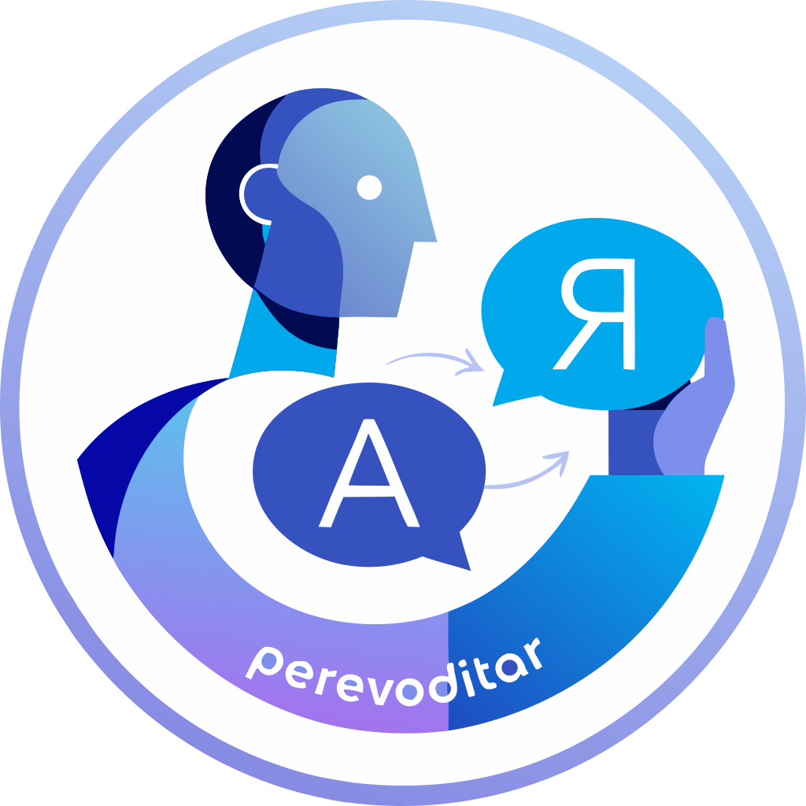

<p align="center">
  
</p>

<h1 align="center">Perevoditarr</h1>

<p align="center">
  <strong>Declarative subtitle-translation orchestration between Bazarr and Lingarr</strong>
</p>

<p align="center">
  <a href="https://github.com/engels74/perevoditarr/blob/main/LICENSE"></a>
  
  
  
  
  
  
  
  <a href="https://deepwiki.com/engels74/perevoditarr"></a>
</p>

Perevoditarr is a self-hosted orchestration and observability layer that sits between
[Bazarr](https://www.bazarr.media/) and [Lingarr](https://github.com/lingarr-translate/lingarr).
It drives subtitle translation *through Bazarr's translate API* as a declarative
reconciliation engine — every translated subtitle stays tracked and upgradeable — while
enforcing hard safety rails (dispatch windows, volume caps, budget ceilings, circuit
breakers, quarantine) and staying safe-by-default.

## Prerequisites

- [Bun](https://bun.sh) >= 1.2
- [uv](https://docs.astral.sh/uv/) with Python >= 3.14
- A reachable **Bazarr** (>= 1.5.6, with `translator_type` set to `lingarr`) and
  **Lingarr** (>= 1.2.4). Older versions are rejected at instance registration.

## Quick Start

Perevoditarr is a monorepo — a Python/Litestar backend and a SvelteKit SPA. In
development you run both; the SPA dev server proxies `/api` to the backend (this
also covers the `/api/v1/events` SSE stream used for live updates).

**Backend** — serves on `http://localhost:8000`:

```bash
cd backend
uv sync
uv run alembic upgrade head
LITESTAR_APP=perevoditarr.app:app uv run litestar run --reload
```

**Frontend** — serves on `http://localhost:5173`:

```bash
cd frontend
bun install
bun run dev
```

Open <http://localhost:5173>. With no users yet, you're redirected to `/setup` to
create the first administrator account.

## Environment Variables

All settings use the `PEREVODITARR_` prefix. The most common ones:

| Variable | Required | Default | Description |
|---|---|---|---|
| `PEREVODITARR_ENV` | No | `dev` | `dev` or `prod`; `prod` requires a secret key. |
| `PEREVODITARR_SECRET_KEY` | In `prod` | — | Session signing key (>= 32 chars). Generate with `openssl rand -hex 32`. |
| `PEREVODITARR_DATABASE_URL` | No | `sqlite+aiosqlite:///perevoditarr.db` | Async SQLAlchemy URL (`postgresql+asyncpg://` or `sqlite+aiosqlite://`). |
| `PEREVODITARR_LOG_LEVEL` | No | `INFO` | `DEBUG`, `INFO`, `WARNING`, or `ERROR`. |

Background-loop cadences (health polling, sync, dispatch, telemetry, …) are tuned via
additional `PEREVODITARR_*_INTERVAL_SECONDS` knobs and are all optional.

## First-Run Setup

1. Start the backend and frontend, then open the app — you're redirected to `/setup`.
2. Create the initial admin account. This is the only write action allowed until an
   admin exists.
3. Sign in, then register your Bazarr and Lingarr instances to begin observing.

You can also create the first admin from the command line:

```bash
cd backend && uv run perevoditarr create-user --username admin
```

## Docker Deployment

_TBD_ — a production container image and Compose examples will be published in a
separate deployment repository.

## API

| Endpoint | Auth | Description |
|---|---|---|
| `GET /api/v1/health` | none | Liveness probe → `{"status":"ok"}`. |
| `/api/v1` | admin session | The application API. |
| `/schema` | none | Interactive OpenAPI docs (Scalar UI). |
| `/metrics` | none | Prometheus metrics (text exposition). |

## License

[AGPL-3.0](LICENSE)
